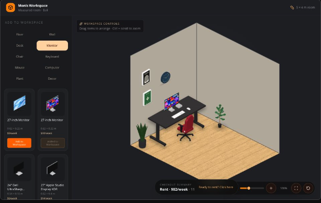

# Monis Workspace Builder



[Vercel Live Preview](https://workspace-builder-five.vercel.app/)

An interactive isometric workspace planner built with Next.js, React, Tailwind CSS, and Zustand.

## Prerequisites

- Node.js 20.9 or later (Node.js 20 LTS recommended)
- npm

Verify your Node.js version:

```bash
node --version
```

If you use `nvm`:

```bash
nvm install 20
nvm use 20
```

## Setup

Install dependencies:

```bash
npm install
```

## Run Locally

Start the development server:

```bash
npm run dev
```

Open [http://localhost:3000](http://localhost:3000).

## Validation

```bash
npm run lint
npm test
npm run build
```

## Approach

I wanted this to feel more like arranging a future workspace than browsing an online catalog. You
pick a category, add an item, and move it around the room until the setup feels right. The weekly
rental total updates along the way, and the checkout summary collects the selected items in one
place.

The placement system uses real-world meter values instead of a visible grid. A monitor stays on
the desk, a chair or plant stays on the floor, and wall decor stays on the wall. Items also have
calibrated footprints, so the app can keep their collision areas from overlapping even when their
sprites have very different shapes.

### How It Is Built

The app uses Next.js, TypeScript, Zustand, Tailwind CSS, and Lucide icons. Zustand holds the whole
workspace state: items, finishes, pan, zoom, and footprint calibration. That state is saved to
browser local storage, so a refresh does not lose the current setup.

For the room, I used a 2.5D approach: the floor and walls are transformed DOM elements with
tileable textures, while the product images are absolutely positioned above them. This keeps the
sprites upright and sharp, and it is much lighter than a WebGL scene.

It is also the biggest trade-off in the project. Making an isometric room with images in the DOM
has limits, and getting every sprite, anchor, and footprint to line up can become difficult. My
first instinct was to use Three.js. A real 3D scene would make the isometric camera and many of
the interactions feel more natural, rather than having to reproduce them with transforms and
placement math.

I chose the DOM approach for this version because consistent 3D assets are hard to create without
previous 3D experience. A mixed-quality asset set would have hurt the result more than the simpler
rendering approach. The local sprite and texture files in `public/` gave me a consistent visual
language to work with.

## What I Would Improve With More Time

If I had more time, I would rebuild the scene with Three.js to give it a complete 3D feel. That
would allow free rotation, richer materials, and a more natural isometric camera. I would keep the
current DOM renderer as a lightweight fallback for devices that cannot use WebGL.

I would also add multi-angle assets, orientation controls, curated starter layouts, more product
options, and a real checkout and delivery workflow. Finally, I would add shareable builds,
keyboard-driven placement, a screen-reader-friendly item list, and broader unit and end-to-end
test coverage.
